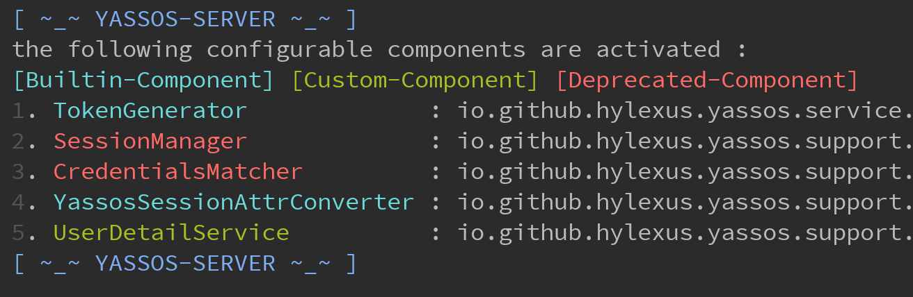

# YaSSOS

**Y**et **a**nother **S**ingle **S**ign-**O**n **S**ystem.

A lightweight, simple single sign-on system based on spring-boot.

See the wiki (Writing…)  for full documentation, examples, custom-configuration and other information.

## Introduction

```sh
~ tree -d -L 1
.
├── docs
├── yassos-client
├── yassos-client-spring-boot-starter
├── yassos-common
├── yassos-distribution
├── yassos-server
├── yassos-server-plugin
│   ├── yassos-session-manager-memory
│   ├── yassos-session-manager-redis
│   ├── yassos-user-loader-file
│   └── yassos-user-loader-jdbc
└── yassos-server-support
```

- **docs:** Document
- **yassos-client:** API for single sign-on system clients.
- **yassos-client-spring-boot-starter:** A `spring-boot-starter`  provided to the spring-boot based clients.
- **yassos-common:** The common module used by YaSSOS.
- **yassos-distribution:** **This module is under development.**
- **yassos-server:** Server side of YaSSOS.
- **yassos-server-support:** Yassos server plugin support
- **yassos-server-plugin:** Builtin YaSSOS Server-Side plugins
  - **yassos-session-manager-memory:** A `memory-based` Session-Manager
  - **yassos-session-manager-redis:** A `redis-based` Session-Manager
  - **yassos-user-loader-file:** A `file-based` user details loader
  - **yassos-user-loader-jdbc:** A `jdbc-based` user details loader, for example, if you want to load user data from MySQL, this plugin may be useful.

## Quick Start

See the wiki (Writing…)  for full documentation, examples, custom-configuration and other information.

> In this example, we will have the following domain mapping (due to `cookie restriction strategy` )  in file `/etc/hosts` :

```sh
127.0.0.1	sso.mine.com
127.0.0.1	web-01.mine.com
127.0.0.1	web-02.mine.com
```

### 1. Start the server-side

- Download & build  server-side

```sh
git clone https://github.com/hylexus/yassos.git

cd yassos
mvn clean package -DskipTests
```

- Start the YaSSOS server-side

```sh
# start server(default port: 5201)
java -jar yassos-server/target/yassos-server.jar
```

- Check the Result

If all goes well, you'll see something like this:



Access http://sso.mine.com:5201/login in your browser.

### 2. Run client samples

- Download and build samples project

```sh
# download sources
git clone https://github.com/hylexus/yassos-samples.git

cd yassos-samples
# package
mvn clean package -DskipTests
```

#### Run the client project based on spring-boot

```
java -jar yassos-client-sample-spring-boot/target/yassos-client-sample-spring-boot-1.0-SNAPSHOT.jar
```

Acess the protected resource http://web-01.mine.com:1010/client/user/me in your browser. And then you will be redirected to login page.

Type the username (`yassos`)  and password (`yassos`) to sign-on.

#### Run the client project based on traditional Java-web-app

> In order to this example to work, you need to install a Tomcat container on your computer.

```sh
# copy the traditional java-web-app to your Tomcat 
cp yassos-client-sample-web-cookie/target/yassos-client-sample-web-cookie.war /path/to/apache-tomcat-8.5.41/webapps
```

- start your tomcat container 

And then access the protected resource http://web-02.mine.com:8080/yassos-client-sample-web-cookie/protected-resources/resource.jsp .

Congratulations, you can access protected resources without logging in this time.


See the wiki (Writing…)  for full documentation, examples, custom-configuration and other information.
