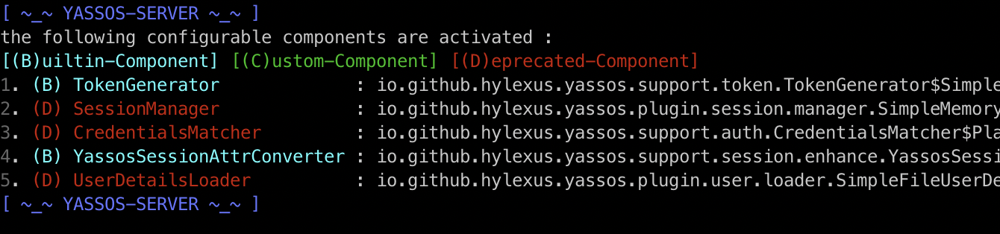

# YaSSOS

<div><svg id="icon-Y4" viewBox="0 0 1024 1024"><path d="M556.4399616 1012.33677653c-67.50426453 0-133.0774016-13.2513792-194.78828373-39.34344533-59.63994453-25.23572907-113.05833813-61.29363627-159.03184214-107.26495573-45.96913493-45.96913493-82.00301227-99.53389227-107.2627712-159.0296576-26.08769707-61.69340587-39.33907627-127.28183467-39.33907626-194.7860992s13.2513792-133.0774016 39.33907626-194.78828374c25.25975893-59.63994453 61.29363627-113.05833813 107.2627712-159.03184213 45.973504-45.96913493 99.3984512-82.13408427 159.03184214-107.2627712 61.70432853-26.08769707 127.2840192-39.33907627 194.78828373-39.33907627 57.42701227 0 113.6132096 9.6600064 167.313408 28.57588054 51.90669653 18.36100267 100.08439467 45.1411968 143.294464 79.37283413 4.4171264 3.58918827 5.24506453 10.07725227 1.65587627 14.49437867-3.61540267 4.4171264-10.10346667 5.24506453-14.52059307 1.65369173-85.2885504-67.63752107-188.31332693-103.52940373-297.62955947-103.52940373C292.061184 32.05802667 76.84532907 247.2738816 76.84532907 511.77280853c0 264.503296 215.21585493 479.71915093 479.7169664 479.71915094 5.6492032 0 10.3415808 4.6923776 10.3415808 10.35250346 0.0131072 5.66667947-4.8037888 10.4923136-10.46391467 10.4923136z"></path><path d="M560.234496 141.1186688c-204.12279467 0-369.59464107 165.4718464-369.59464107 369.59464107S356.11170133 880.31013547 560.234496 880.31013547c204.1249792 0 369.5968256-165.4718464 369.5968256-369.5968256S764.3529216 141.1186688 560.234496 141.1186688z m24.28327253 411.85225387v150.02282666H537.64642133v-150.02282666L401.15022507 348.8284672h57.0097664l69.8155008 106.77562027a1071.05047893 1071.05047893 0 0 1 35.9989248 59.91738026c10.6299392-18.5204736 23.50994773-39.37839787 38.6531328-62.57595733l68.6096384-104.11922773h54.59585706l-141.3152768 204.14464z"></path></svg></div>
**Y**et **a**nother **S**ingle **S**ign-**O**n **S**ystem.

A lightweight, simple single sign-on system based on spring-boot.

See the wiki (Writing…)  for full documentation, examples, custom-configuration and other information.

## Introduction

```sh
~ tree -d -L 1
.
├── docs
├── yassos-client
├── yassos-client-spring-boot-starter
├── yassos-common
├── yassos-distribution
├── yassos-server
├── yassos-server-plugin
│   ├── yassos-session-manager-memory
│   ├── yassos-session-manager-redis
│   ├── yassos-user-loader-file
│   └── yassos-user-loader-jdbc
└── yassos-server-support
```

- **docs:** Document
- **yassos-client:** API for single sign-on system clients.
- **yassos-client-spring-boot-starter:** A `spring-boot-starter`  provided to the spring-boot based clients.
- **yassos-common:** The common module used by YaSSOS.
- **yassos-distribution:** script for build package.
- **yassos-server:** Server side of YaSSOS.
- **yassos-server-support:** Yassos server plugin support
- **yassos-server-plugin:** Builtin YaSSOS Server-Side plugins
  - **yassos-session-manager-memory:** A `memory-based` Session-Manager
  - **yassos-session-manager-redis:** A `redis-based` Session-Manager
  - **yassos-user-loader-file:** A `file-based` user details loader
  - **yassos-user-loader-jdbc:** A `jdbc-based` user details loader, for example, if you want to load user data from MySQL, this plugin may be useful.

## Quick Start

See the wiki (Writing…)  for full documentation, examples, custom-configuration and other information.

> In this example, we will have the following domain mapping (due to `cookie restriction strategy` )  in file `/etc/hosts` :

```sh
127.0.0.1	sso.mine.com
127.0.0.1	web-01.mine.com
127.0.0.1	web-02.mine.com
```

### 1. Start the server-side

- Download & build  server-side

```sh
git clone https://github.com/hylexus/yassos.git

cd yassos
./gradlew clean build
```

- Start the YaSSOS server-side

```sh
# start server(default port: 5201)
java -jar yassos-server/build/libs/yassos-server.jar
```

- Check the Result

If all goes well, you'll see something like this:



Access http://sso.mine.com:5201/login in your browser.

### 2. Run client samples

- Download and build samples project

```sh
# download sources
git clone https://github.com/hylexus/yassos-samples.git

cd yassos-samples
# package
mvn clean package -DskipTests
```

#### Run the client project based on spring-boot

```
java -jar yassos-client-sample-spring-boot/target/yassos-client-sample-spring-boot-1.0-SNAPSHOT.jar
```

Acess the protected resource http://web-01.mine.com:1010/client/user/me in your browser. And then you will be redirected to login page.

Type the username (`yassos`)  and password (`yassos`) to sign-on.

#### Run the client project based on traditional Java-web-app

> In order to this example to work, you need to install a Tomcat container on your computer.

```sh
# copy the traditional java-web-app to your Tomcat 
cp yassos-client-sample-web-cookie/target/yassos-client-sample-web-cookie.war /path/to/apache-tomcat-8.5.41/webapps
```

- start your tomcat container 

And then access the protected resource http://web-02.mine.com:8080/yassos-client-sample-web-cookie/protected-resources/resource.jsp .

Congratulations, you can access protected resources without logging in this time.


## distribution

Currently supported parameters:

| Key               | Value                    |
| ----------------- | ------------------------ |
| `user-loader`     | `file-user-loader`       |
|                   | `jdbc-user-loader`       |
| `session-manager` | `memory-session-manager` |
|                   | `redis-session-manager`  |

- `file-user-loader`
  - A builtin `user-loader` that load user info from a file specified by `yassos.user-store.file.file-location` in `application.yml` 
- `jdbc-user-loader`
  - A `JDBC-Based` `UserLoader`
  - You should specify the  configuration `spring.datasource.*` in `application.yml`，see `${installation_dir}/conf/yassos-server-example-full-config.yml` for full config samples
- `memory-session-manager`
  - A `Memory-Based SessionManager`
- `redis-session-manager`
  - A `Redis-Based SessionManager`
  - You should specify the configuraion `spring.redis.*` in  `application.yml`，see `${installation_dir}/conf/yassos-server-example-full-config.yml` for full config samples

```sh
./gradlew clean build releaseYassosServer \
-Duser-loader=file-user-loader \
-Dsession-manager=memory-session-manager
```

> Note:
>
> `-Duser-loader=file-user-loader` means that you will use a builtin `UserLoader` to load user info from a file  specified by `yassos.user-store.file.file-location` in `application.yml` .
>
> `-Dsession-manager=memory-session-manager` means that you wil use a builtin SessionManager base on memory.


And then, `yassos-server-1.0-SNAPSHOT.tar.gz` and `yassos-server-1.0-SNAPSHOT.tar.zip` was generated in `build/distributions`.


You can copy `yassos-server-1.0-SNAPSHOT.tar.gz` to you installation directory. 

```sh
# copy tar.gz to you installation directory
cp build/distributions/yassos-server-1.0-SNAPSHOT.tar.gz /usr/local/opt/yassos
# Decompression
cd /usr/local/opt/yassos/yassos-server-1.0-SNAPSHOT
# start the yassos server
bin/yassos-server.sh start
```

- distribution structure

```sh
~ tree  -L 2
.
├── LICENSE
├── NOTICE
├── bin
│   ├── yassos-server.bat
│   └── yassos-server.sh
├── conf
│   ├── application.yml
│   ├── logback.xml
│   └── yassos-server-example-full-config.yml # full configuration samples
└── lib
    └── yassos-server.jar
```


See the wiki (Writing…)  for full documentation, examples, custom-configuration and other information.