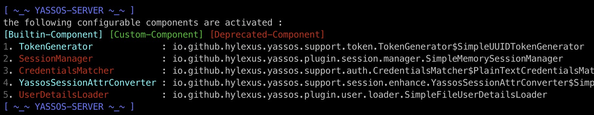

# YaSSOS

YaSSOS：轻量级的、精简的基于spring-boot的单点登录系统。

完整的文档（文档正在编写……）、示例、定制化配置等，请看wiki。

## 介绍

```sh
~ tree -d -L 1
.
├── docs
├── yassos-client
├── yassos-client-spring-boot-starter
├── yassos-common
├── yassos-distribution
├── yassos-server
├── yassos-server-plugin
│   ├── yassos-session-manager-memory
│   ├── yassos-session-manager-redis
│   ├── yassos-user-loader-file
│   └── yassos-user-loader-jdbc
└── yassos-server-support
```

- **docs:** 文档
- **yassos-client:** 给客户端(接入方)用的API
- **yassos-client-spring-boot-starter:** 提供给基于 spring-boot 的客户端(接入方)的  `spring-boot-starter`  
- **yassos-common:** 用到的公共模块
- **yassos-distribution:** **该模块正在开发中……**
- **yassos-server:** 单点登录系统的服务端
- **yassos-server-support:** 服务端插件API,所有的服务端插件都应该依赖该模块
- **yassos-server-plugin:** 内置的服务端插件
  - **yassos-session-manager-memory:** `基于内存` 的session管理器
  - **yassos-session-manager-redis:** `基于redis` 的session管理器
  - **yassos-user-loader-file:** 基于文件的用户数据加载器
  - **yassos-user-loader-jdbc:** 基于jdbc的用户数据加载器，比如从MySQL等加载用户数据都可以使用该插件

## 快速开始

完整的文档（文档正在编写……）、示例、定制化配置等，请看wiki。

> 在该示例中，我们将假定在你的/etc/hosts文件中有如下域名映射(cookie限制)：

```sh
127.0.0.1	sso.mine.com # YaSSos服务端
127.0.0.1	web-01.mine.com # YaSSOS客户端(接入方)
127.0.0.1	web-02.mine.com # YaSSOS客户端(接入方)
```

### 1. 启动Yassos服务端

- 下载源码、打包服务端

```sh
git clone https://github.com/hylexus/yassos.git

cd yassos
mvn clean package -DskipTests
```

- 启动YaSSOS服务端

```sh
# 启动服务端(默认端口: 5201)
java -jar yassos-server/target/yassos-server.jar
```

- 查看结果

如果一切正常的话，你将看到类似于下图所示的输出：



用浏览器访问 http://sso.mine.com:5201/login ，你将看到YaSSOS的默认登录页面。

### 2. 运行客户端示例

- 下载、打包客户端示例

```sh
# 下载源码
git clone https://github.com/hylexus/yassos-samples.git

cd yassos-samples
# 打包
mvn clean package -DskipTests
```

#### 运行基于spring-boot的客户端示例项目

```
java -jar yassos-client-sample-spring-boot/target/yassos-client-sample-spring-boot-1.0-SNAPSHOT.jar
```

用浏览者访问受保护资源 http://web-01.mine.com:1010/client/user/me 。此时，你应该会被重定向到登录页。

输入用户名 (`yassos`)  和密码 (`yassos`) 登录。

#### 运行基于传统java-web的客户端示例项目

> 为了正常运行该示例项目，你的电脑上应该先按照Tomcat容器。

```sh
# copy the traditional java-web-app to your Tomcat 
cp yassos-client-sample-web-cookie/target/yassos-client-sample-web-cookie.war /path/to/apache-tomcat-8.5.41/webapps
```

- 启动Tomcat容器

然后访问受保护资源 http://web-02.mine.com:8080/yassos-client-sample-web-cookie/protected-resources/resource.jsp .

这次你应该可以直接访问受保护资源（不用再次登录）。


完整的文档（文档正在编写……）、示例、定制化配置等，请看wiki。
